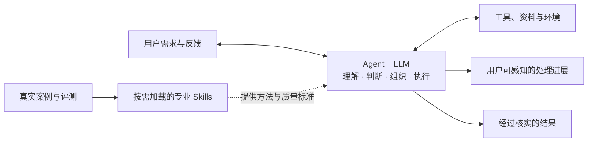

# z-skills

`z-skills` 是一套 Agent 专业 Skill 体系，维护供 Agent 按需加载、组合和持续演化的专业 Skills。它的目标是让同一个 Agent 面对不同类型的需求时，能够采用相应领域的专业方法，形成用户需要的理解、判断、内容或实际成果。

例如，概念理解需要围绕背景、关系、例子、反例和应用形成完整认识；软件开发需要根据实际问题组合产品、设计、实现、测试、评审、验收或发布方法；小说写作和工作总结也应分别拥有符合各自质量标准的 Skills。

当前仓库首先提供软件开发领域的 Skill 集合，并提供一套从真实案例形成、验证和改进 Skill 的方法。

## 核心设计

- Agent+LLM 是理解、判断、Skill 选择与组合、工具调用、过程推进和结果整合的主体。
- Skill 是可复用的专业方法资产，不是 Agent、子 Agent、工具或独立执行器。
- 项目不在 Agent 之上增加一套通用工作流。Agent 根据当前需求动态形成处理路径。
- Skill 没有固定的“编排”“专业”“场景”类型。主导、辅助或组织其他方法，是 Skill 在某次任务中的运行角色。
- 用户可以指定方法，也可以让 Agent 自行选择；用户始终能够感知关键进展并决定参与程度。

完整结构见 [设计文档](./docs/design.md)。

## 一次需求如何处理

Agent 结合完整对话和环境理解用户实际想取得的结果，再判断是否需要 Skill。简单请求可以直接处理；需要稳定专业方法时，可以应用一个或多个 Skills。

Skills 提供适用条件、方法、质量标准和组合提示，Agent 据此组织当前任务的具体路径。过程中出现新证据、目标修正或用户决定时，Agent 更新路径，而不是服从一条预设的统一流水线。

Agent 在开始、方向变化、取得关键证据、需要用户决定和完成时表达必要进展。展示粒度和用户参与点由用户决定；内部推理过程不作为进度说明。

## Skill 的最小契约

每个 Skill 应清楚说明：

1. 它帮助取得什么结果；
2. 何时适用，何时不适用；
3. 所采用的专业方法；
4. 结果应满足什么质量或证据标准；
5. 自身边界以及与其他方法的组合提示。

只有确有需要时才增加脚本、参考资料、模板、状态或严格步骤。Skill 的价值来自方法的专业深度和可重复结果，不来自文档长度或层级位置。

## 当前 Skill 集合

以下分组只用于查找，不是永久类型，也不规定调用顺序。

| 查找方向 | Skills |
|---|---|
| 理解问题与证据 | `z-clarify`、`z-explore`、`z-research`、`z-triage` |
| 产品与设计 | `z-product`、`z-model-domain`、`z-ui-design`、`z-architecture`、`z-tech`、`z-prototype` |
| 实现与质量 | `z-implement`、`fix-bug`、`z-debug`、`z-tdd`、`z-code-review`、`z-verify`、`z-release` |
| 复杂工作支撑 | `z-spec`、`z-tasks`、`z-improve`、`z-handoff` |
| Skill 演化 | `z-evolve-skills` |

Agent 可以直接使用其中任意一个，也可以根据当前任务组合多个。Skill 文档中提到另一个 Skill 时，它表达的是组合候选；是否应用、何时应用以及如何整合，仍由 Agent 根据当前上下文决定。

## 项目结构

| 位置 | 职责 |
|---|---|
| [`docs/design.md`](./docs/design.md) | 当前有效的整体设计与职责边界 |
| `skills/*/SKILL.md` | 单个 Skill 的适用条件、方法、边界和质量标准 |
| `skills/*/agents/openai.yaml` | Skill 的展示信息与调用元数据 |
| [`skills/_shared/`](./skills/_shared) | 多个 Skills 按需读取的专业参考资料 |
| [`docs/evaluation.md`](./docs/evaluation.md) | Skill 发现、选择、组合、边界与演化的行为基线 |

## 源码与运行副本

当前仓库是这些文档和 Skills 的维护来源。运行时 Skill 目录是部署副本，只通过明确的部署动作从本仓库更新；运行副本中的临时变化不反向定义项目设计。

修改 Skill 时，应同时更新其 `SKILL.md`、调用元数据和相关评测案例，并用真实正例、反例和组合案例验证。形成新 Skill 或改进现有 Skill 的完整方法由 `z-evolve-skills` 记录。
