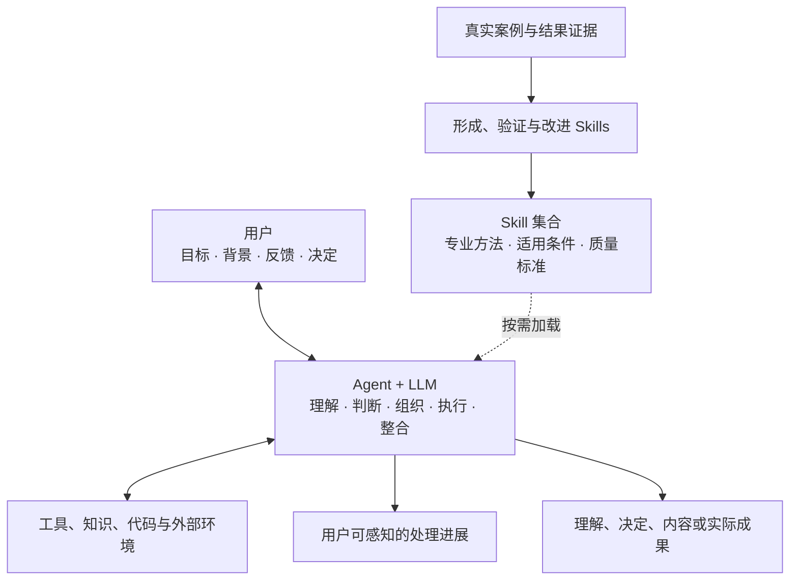
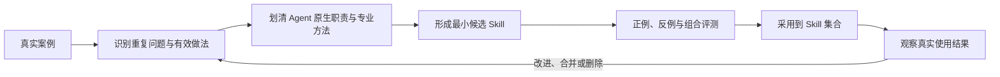

# z-skills 设计

状态：当前有效设计。

本文是项目整体设计的唯一事实来源。它说明项目要形成什么能力，Agent、Skill 和工具分别负责什么，以及 Skills 如何形成、组合和演化。单个 Skill 的具体方法只写在对应 `SKILL.md` 中。

## 1. 项目定位

`z-skills` 建设的是 **Agent 专业 Skill 体系**：把不同类型工作中稳定、可复用、可验证的专业处理方法沉淀为 Skills，供 Agent 面对具体需求时按需选择和组合。

目标效果是：

- 用户想了解一个概念时，Agent 能组织背景、核心含义、关系、例子、反例、应用与理解核对，帮助用户形成清晰认识；
- 用户想开发软件时，Agent 能根据项目实际情况组织澄清、产品设计、领域建模、界面设计、架构、技术设计、实现、测试、评审、验收与发布等专业方法；
- 用户想写小说、工作总结或处理其他工作时，可以由对应领域的 Skills 提供该领域的方法和质量标准；
- 一项需求跨越多个专业问题时，Agent 能把相关 Skills 组织成一条连续、可感知的处理路径并整合结果；
- 从真实工作中反复出现的有效处理方式，能够被提炼为新的 Skill，并经过验证后进入体系。

当前仓库首先实现软件开发领域的专业方法。其他领域沿用同一设计逐步增加，而不改变 Agent 的运行机制。

## 2. 底层模型

系统只有一个实际处理主体：Agent+LLM。项目向它提供专业方法资产，工具为它连接资料与实际环境。

这里没有独立的通用工作流执行层。所谓“当前处理过程”，是 Agent 围绕当前需求，结合已有 Skills、环境反馈和用户选择动态形成的实际路径。

## 3. 职责边界

### 3.1 用户

用户提供希望取得的结果、背景和反馈，并作出只有用户能够决定的目标、偏好、接受标准与影响范围选择。用户可以指定 Skill，也可以完全不关心 Skill 名称；可以要求更多或更少的过程信息，可以暂停、纠正或改变方向。

### 3.2 Agent+LLM

Agent+LLM 负责：

- 结合完整对话与环境理解当前发言和整体目标；
- 判断当前问题的性质、已知事实、关键未知和需要的专业能力；
- 决定直接处理，还是选择一个或多个 Skills；
- 确定 Skills 在当前任务中的作用、顺序、并行关系和退出时机；
- 把 Skill 方法适配到具体上下文，而不是机械执行文字步骤；
- 调用工具、读取反馈、修正判断并整合局部结果；
- 向用户表达关键进展，在需要用户决定时提出清晰问题；
- 根据实际证据判断结果是否满足当前要求。

这些能力属于 Agent 的原生执行循环，不需要再被包装成路由 Skill、总控 Skill 或通用工作流。

完整上下文理解、用户参与、行动授权、过程可见和结果真实性由宿主 Agent 的运行规则保证。本项目把它们作为使用 Skills 的运行前提，不再提供一份全局指令去重复实现宿主能力。

### 3.3 Skill

Skill 负责提供某类工作的专业方法，包括适用条件、重要判断、处理结构、质量标准、证据要求以及必要的组合提示。它可以覆盖一个完整问题，也可以只解决一个局部问题。

Skill 不理解当前用户的全部意图，不自行决定是否生效，不直接调用工具或其他 Skills，也不负责整项任务的控制。Agent 加载并应用 Skill 后，所有实际理解、选择、行动和整合仍由 Agent 完成。

### 3.4 工具与资料

工具负责读取、计算、编辑、运行、发布或访问外部系统，并返回可观察反馈。参考资料、模板和脚本为 Skill 提供所需材料。它们都不承担需求理解、方法选择或专业判断。

### 3.5 责任对照

| 事项 | 负责者 | Skill 可以提供的帮助 |
|---|---|---|
| 理解用户真正想取得什么 | Agent+LLM | 提供该专业看问题的角度和关键问题 |
| 判断是否需要 Skill | Agent+LLM | 用描述、适用条件和反例帮助发现 |
| 选择与组合 Skills | Agent+LLM；用户可指定 | 提供边界、依赖事实和组合提示 |
| 形成当前具体处理路径 | Agent+LLM | 提供稳定方法、分支条件和质量标准 |
| 调用工具与读取反馈 | Agent+LLM | 提示需要什么证据或工具能力 |
| 组织用户参与和过程表达 | Agent+LLM | 提示该专业工作中值得显露的里程碑 |
| 判断专业结果质量 | Agent+LLM 依据证据判断 | 提供可检查的局部或整体标准 |
| 整合并交付最终结果 | Agent+LLM | 提供结果结构和重要完整性要求 |

## 4. Skill 没有固定类型

“编排 Skill”“专业 Skill”不是 Codex 的原生类别，也不作为本项目的永久分类。Skill 只有自身范围和方法；它在某次任务中可以承担不同运行角色：

- 用户单独要求架构设计时，`z-architecture` 主导当前工作；
- 开发一项功能时，同一个 `z-architecture` 可能只辅助解决其中的系统边界问题；
- `z-implement` 在明确的软件改动中可以提供贯穿结果的完整方法，也仍然只是被 Agent 应用的一个 Skill；
- 一个范围较大的 Skill 可以建议何时需要其他专业方法，但实际选择和组织仍由 Agent 完成。

因此，主导、辅助和组织是运行时关系，不写成 Skill 的身份。Skill 的范围也不追求机械最小化：它应小到边界清楚、能够组合，又应深到确实保存了可复用的专业能力。

## 5. Skill 与 Agent 原生能力的分界

一项内容适合留给 Agent 原生处理，当它依赖当前上下文、每次都需要重新判断，或本来就是 Agent 运行能力的一部分，例如理解最近发言、选择下一步、决定用哪个 Skill、调用工具和汇总答案。

一项内容适合形成 Skill，当它满足以下特征中的多数：

- 在同类工作中反复出现；
- 存在领域特有的判断、步骤、证据或质量标准；
- 只靠通用推理容易遗漏、漂移或重复发明；
- 可以清楚说明适用条件和边界；
- 能用代表性案例检验是否改善结果；
- 加载成本与专业收益相称。

Skill 出现的根本原因，是把模型可能知道但不一定稳定采用的专业方法，变成可发现、可复用、可检查和可改进的上下文资产。它增强 Agent 的处理质量，不复制 Agent 的控制循环。

## 6. 发现、选择与组合

### 6.1 发现

Skill 用准确的名称、描述、适用条件和反例向 Agent 暴露能力。Agent 必须先理解当前需求，再匹配 Skill；关键词只能作为线索，不能代替意图判断。

### 6.2 选择

- 用户明确指定 Skill 时，Agent 应应用该方法；如果缺失、不适用或与更高优先级约束冲突，应说明原因。
- 用户没有指定时，Agent 根据结果目标、问题性质、风险、证据和上下文成本，选择零个、一个或多个 Skills。
- 简单请求直接处理即可。加载 Skill 必须带来实际专业收益。
- 不设置中央路由 Skill。Skill 选择就是 Agent 的原生职责。

### 6.3 组合

1. Agent 保持对用户整体目标和当前授权的统一理解。
2. 每个 Skill 只在自身适用范围内提供方法和局部标准。
3. Skill 文档可以指出其他方法何时有价值，但它不能直接启动另一个 Skill。
4. Agent 决定组合顺序、是否并行、何时退出，并把前一项结果作为后一项输入。
5. 多个 Skill 的约束互补时共同生效；发生实质冲突时，Agent 先根据目标和证据消解，涉及用户取舍时请用户决定。
6. Agent 把局部结果整合为一项连续交付，不把多个 Skill 输出简单拼接给用户。

组合关系由具体需求产生，不维护全局固定链路。例如，一项软件改动可能只需要 `z-implement`，也可能在实际证据要求下组合 `z-ui-design`、`z-tech`、`z-tdd` 和 `z-code-review`；这不是两种不同架构。

## 7. 方法选择与行动授权

采用什么方法和允许产生什么影响是两个独立问题。

- 指定或自动选择 Skill，只决定 Agent 如何处理当前事项；
- 文件修改、外部写入、提交、发布或其他影响，来自用户请求和仍有效的任务授权；
- Skill 继承当前目标、范围和授权，不扩大它们；
- 技术权限只说明环境是否允许执行，也不代替用户授权；
- 从一个 Skill 转向另一个 Skill 不要求形式化重复授权，但新行动超出原范围时必须重新取得用户决定。

这项分离让 Agent 可以自主组织专业方法，同时保持用户对结果和影响范围的控制。

## 8. 用户可感知的处理过程

过程可见由 Agent 负责，Skill 可以补充该领域的重要里程碑。可感知不等于公开内部思维链，而是让用户能够理解工作正在怎样推进并及时介入。

| 时点 | 应表达的信息 |
|---|---|
| 开始处理 | 当前理解、准备采用的专业方向、第一项可观察行动 |
| 取得关键结果 | 已确认的事实或成果、它如何改变后续方向 |
| 路径发生变化 | 原判断为何失效、现在采用什么方法 |
| 需要用户决定 | 具体取舍、影响和推荐依据 |
| 完成 | 实际结果、关键证据、仍需注意的假设或后续事项 |

用户决定过程信息的粒度、介入时机和推进方式。Agent 应根据工作长度、风险和用户反馈调整表达，既不让长时间工作失去可见性，也不把每个内部动作都变成确认点。

## 9. Skill 契约

每个 Skill 至少应提供：

| 内容 | 作用 |
|---|---|
| 名称与描述 | 让用户和 Agent 知道它帮助取得什么结果 |
| 适用条件与反例 | 支持准确发现并避免误用 |
| 专业方法 | 保存该领域中稳定且有价值的处理方式 |
| 输出与质量标准 | 说明应产生什么以及如何判断有效 |
| 边界与组合提示 | 防止越界，并指出何时需要其他能力 |

步骤、状态、模板、脚本、参考资料和依赖只在确有需要时增加。所有 Skill 不必共享同一套阶段或产物模板，也不需要声明固定运行角色。

## 10. Skill 的形成与演化

Skill 可以来自成熟专业实践，也可以来自 Agent 与用户共同完成工作的真实过程。形成过程由 `z-evolve-skills` 提供方法：

关键要求：

1. 从原始需求、实际行动、结果和反馈建立证据，不从抽象愿望直接制造大型流程。
2. 提取领域特有且可复用的方法，不把理解用户、选择 Skill 或调用工具等 Agent 原生职责写入 Skill。
3. 先形成边界清楚的候选，再用代表性成功案例、误触发反例和组合案例验证。
4. 同时评估选择准确性、专业结果质量、组合表现、过程可见性、授权边界和上下文成本。
5. 验证通过后才进入正式集合；真实使用持续提供改进证据。
6. 重复、浅薄、过时或收益不足的 Skill 应合并或删除，使体系保持清楚。

用户要求“分析我的处理方式并总结成 Skill”时，Agent 负责理解案例、判断稳定模式并组织形成过程；`z-evolve-skills` 提供提炼、验证和采用的方法。

## 11. 当前实现

当前仓库包含 22 个软件开发相关 Skills。README 中的分组只用于浏览；每个 Skill 的真实接口以自身 `description` 和正文为准。

| 资产 | 作用 |
|---|---|
| `skills/*/SKILL.md` | 软件专业方法及 Skill 演化方法 |
| `skills/*/agents/openai.yaml` | 展示名称、简述、默认提示与调用策略 |
| `skills/_shared/` | 多个 Skills 可按需加载的代码设计与决定记录参考 |
| `docs/evaluation.md` | 选择、组合、过程、边界和演化的行为评测基线 |

当前源码不维护中央路由器、固定 Skill 类型、统一任务状态或强制全链路。新增领域时，增加该领域真正需要的 Skills、资料和评测案例即可。

## 12. 源码与部署边界

本仓库是项目文档和 Skills 的唯一维护来源。运行时 Skill 目录或其他项目中的副本属于部署目标，不反向充当源码。

源码修改与部署是两个动作：修改本仓库不自动改变运行副本；更新运行副本需要用户对相应目标的明确授权，并在部署后核对内容与可发现性。

## 13. 文档职责

| 文档 | 唯一职责 |
|---|---|
| `README.md` | 项目入口、核心结论、当前资产和阅读导航 |
| `docs/design.md` | 当前有效的完整系统设计 |
| `skills/*/SKILL.md` | 单个 Skill 的专业方法与使用契约 |
| `docs/evaluation.md` | 可重复的系统行为评测基线 |

相同规则只保留一个权威来源。历史运行日志、重复术语表和已经被新设计取代的文档不继续保留。
