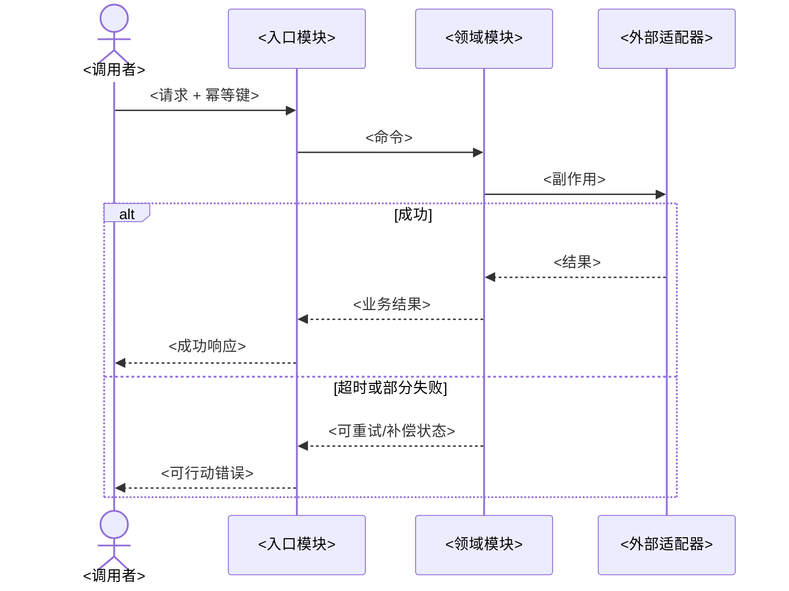
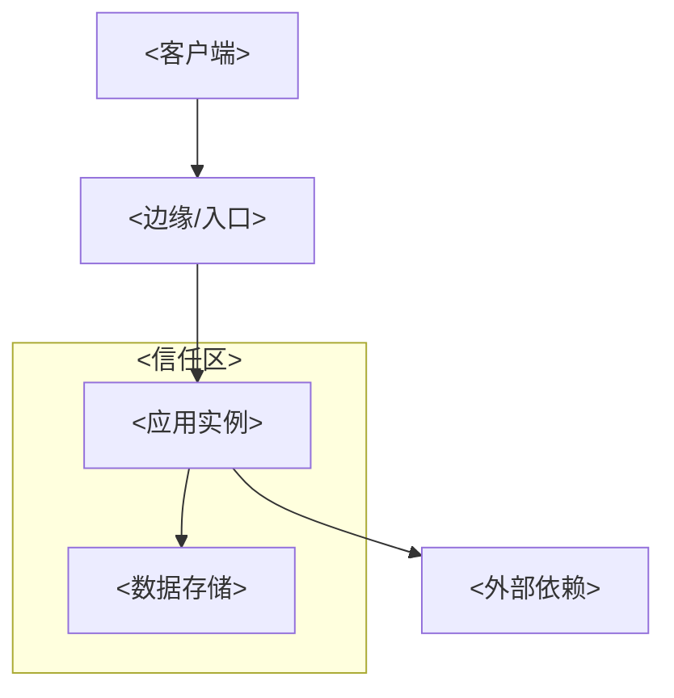

# 02 架构设计

> 结果：用足以支撑实现和验证的少量视图，明确系统语境、模块职责、接口、数据所有权、运行方式和关键取舍。

| 字段 | 内容 |
|---|---|
| 状态 | 草案 / 评审中 / 已批准 / 已取代 |
| 负责人 | [填写] |
| 评审人 | [填写] |
| 最后更新 | YYYY-MM-DD |
| 范围/版本 | [填写] |
| 关联项 | [01、ADR、代码、原型、部署图] |

## 1. 架构驱动因素

| ID | 驱动因素 | 来源 | 对设计的影响 | 优先级 |
|---|---|---|---|---|
| UC-XX / QR-XX / CON-XX | [关键场景、质量需求或约束] | [01 章节] | [它迫使架构做什么] | [填写] |

只保留会改变模块划分、数据所有权、部署、一致性或故障策略的驱动因素。

## 2. 利益相关者、关注点与视图

按 [ISO/IEC/IEEE 42010:2022](https://www.iso.org/standard/74393.html) 的思路，每张图都应回答明确受众的具体问题。

| 利益相关者 | 关注点 | 视图 | 回答的问题 | 权威来源 |
|---|---|---|---|---|
| 产品/业务 | 范围、外部交互 | 系统上下文 | 谁使用、依赖谁、责任到哪里 | 本文档 |
| 开发/测试 | 职责、接口、不变式 | 容器与模块 | 如何实现、替换和验证 | 本文档 + 代码 |
| 运维/安全 | 部署、信任区、故障 | 部署与运行 | 运行在哪里、如何失败和恢复 | IaC + 08 |

## 3. 架构原则与约束

| ID | 原则/约束 | 理由 | 可验证表现 | 例外机制 |
|---|---|---|---|---|
| AP-01 | [例：每类业务数据只有一个写入所有者] | [驱动因素] | [静态检查/契约测试] | [ADR + 审批人] |

原则不应是“使用微服务”等预先指定的实现答案。它应表达为了某个驱动因素必须长期保持的约束。

## 4. 系统上下文

使用 [C4 model](https://c4model.com/) 的系统上下文层级表达人、本系统和外部系统。只画真实存在的交互，边上标注交互目的、方向和关键协议。

| 外部对象 | 交互目的 | 输入/输出 | 信任关系 | 可用性假设 | 负责人 |
|---|---|---|---|---|---|
| [人/系统] | [填写] | [概念级] | [可信/不可信及理由] | [SLA/未知] | [填写] |

## 5. 容器与部署单元

“容器”在本节指可独立运行或部署的应用/数据存储，不等同于 Docker 容器。

| ID | 容器/部署单元 | 职责 | 技术选择 | 入站/出站接口 | 状态 | 扩展单元 | 负责人 |
|---|---|---|---|---|---|---|---|
| CNT-01 | [填写] | [一句话] | [选择 + ADR] | [IF-XX] | 无状态/有状态 | [实例/分区/队列] | [填写] |

## 6. 模块设计

模块是同时面向调用者和测试的设计单元。一个模块只有一个对外接口，接口包括类型、不变式、调用顺序、错误模式、配置和性能特性，不只是方法签名。

| ID | 模块 | 单一职责 | 对外接口 | 隐藏的复杂性 | 不变式 | 所有数据 | 依赖 | 故障模式 |
|---|---|---|---|---|---|---|---|---|
| MOD-XXX | [填写] | [一句话] | IF-XXX | [规则/编排/优化] | BR-XX | DATA-XX | [模块/适配器] | [可重试/不可重试/降级] |

### 6.1 模块深度检查

- 模块接口是否比其实现简单，调用者是否真正少学了知识？
- 能否减少方法、参数或调用顺序，将规则收入实现？
- 删除该模块后，复杂性会消失，还是会散落到多个调用者？前者通常是传递层。
- 测试能否通过同一接口验证关键行为，而无需穿透实现？

### 6.2 接缝与适配器

接缝是可不修改调用位置而替换行为的地方；适配器是满足该接口的具体角色。只有行为实际变化、存在两个适配器，或有明确的测试/运行隔离需求时才引入接缝。

| 接缝 | 接口 | 生产适配器 | 其他适配器 | 变化理由 | 契约测试 |
|---|---|---|---|---|---|
| [位置] | IF-XXX | [填写] | [内存/测试/另一供应商] | [填写] | TEST-CONTRACT-XX |

## 7. 关键运行视图

对每个高风险或跨多模块场景绘制一张序列图，同时表达成功和关键失败路径。

## 8. 数据所有权与一致性

| 数据 | 唯一写入模块 | 读取模块 | 一致性要求 | 传播方式 | 冲突处理 | 详细设计 |
|---|---|---|---|---|---|---|
| DATA-XXX | MOD-XXX | [填写] | 强/最终/会话 | [调用/事件/复制] | [填写] | [07 章节] |

跨模块事务必须写明原子性范围、中间状态、重试、去重、补偿和人工介入方式。

## 9. 部署与信任区

图中标出网络区域、加密终止点、身份传递、密钥使用、有状态资源、多区/多地域和外部依赖。细节在 [08 平台、安全与可靠性](./08-platform-security-reliability.md) 中维护。

## 10. 横切决定

| 主题 | 决定 | 适用范围 | 不变式 | 验证 | ADR/详细文档 |
|---|---|---|---|---|---|
| 身份与权限 | [填写] | [填写] | [默认拒绝等] | [填写] | [链接] |
| 配置与密钥 | [填写] | [填写] | [禁止进入制品等] | [填写] | [链接] |
| 错误语义 | [填写] | [填写] | [填写] | [契约测试] | 06 |
| 可观测性 | [关联 ID/必备属性] | [填写] | [不记录敏感值] | [查询/告警测试] | 08 |

## 11. 决策、风险与验证

| ID | 候选/风险 | 关键不确定性 | 验证方式 | 成功标准 | 截止日期 | 结果/ADR |
|---|---|---|---|---|---|---|
| RISK-XX | [填写] | [填写] | [原型/基准测试/故障演练] | [量化阈值] | YYYY-MM-DD | [填写] |

以下情况通常需要独立 ADR：难以逆转、改变公共接口或数据所有权、引入长期运维成本、影响多个团队，或为满足某项质量需求排除了其他可行方案。

## 12. 完成检查

- [ ] 每张图都有受众、关注点、图例和最后更新日期。
- [ ] 系统上下文、部署单元、模块和运行视图之间名称一致。
- [ ] 每个模块有单一职责、小接口、明确不变式和可验证故障模式。
- [ ] 每类数据有唯一写入所有者，跨模块一致性策略已明确。
- [ ] 外部依赖、信任区、超时、重试、降级和恢复方式可见。
- [ ] 关键取舍有 ADR，高风险假设有在实现前可完成的验证。

