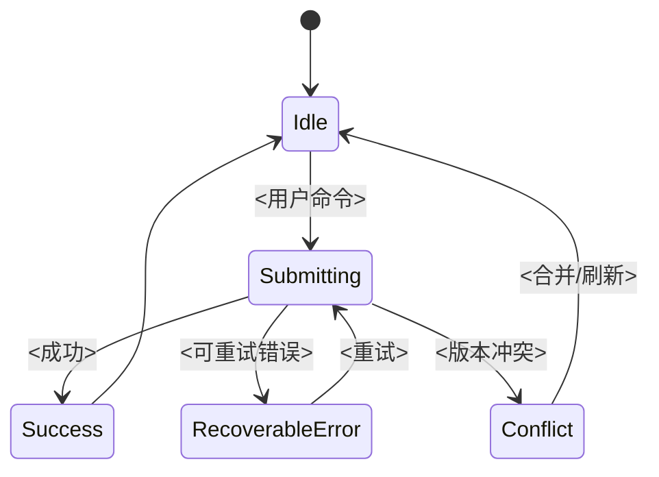

# 04 前端设计

> 结果：将已确认的 UI/UX 方案转换为边界清晰、状态可推理、性能可度量且可独立验证的客户端设计。

| 字段 | 内容 |
|---|---|
| 状态 | 草案 / 评审中 / 已批准 / 已取代 |
| 负责人 | [填写] |
| 评审人 | [前端、UI/UX、后端、测试、安全] |
| 最后更新 | YYYY-MM-DD |
| 范围/版本 | [客户端、页面或功能] |
| 关联项 | [03、OpenAPI、设计令牌、代码、ADR] |

## 1. 目标平台与运行约束

| 平台 | 支持范围 | 输入 | 渲染/运行模式 | 网络假设 | 更新方式 | 特殊约束 |
|---|---|---|---|---|---|---|
| [Web/iOS/Android/桌面] | [版本/浏览器/设备] | 键盘/指针/触摸 | SSR/CSR/混合/原生 | [在线/弱网/离线] | [商店/热更/持续部署] | [填写] |

列出不支持的环境和可观察表现，不用“主流浏览器”等模糊范围。

## 2. 前端架构驱动因素

| ID | 驱动因素 | 影响 | 设计响应 | 验证 |
|---|---|---|---|---|
| UC-XX / QR-XX | [高频任务、首屏、离线、多语言等] | [填写] | [填写] | TEST-XX |

## 3. 模块与依赖方向

| ID | 模块 | 职责 | 对外接口 | 所有状态 | 允许依赖 | 禁止依赖 | 测试表面 |
|---|---|---|---|---|---|---|---|
| MOD-FE-XX | [业务切片/平台基础] | [一句话] | [路由/用例/视图模型] | [填写] | [填写] | [填写] | [接口级] |

优先按业务能力形成深模块，将数据获取、状态转换、权限和错误语义收在小接口后。不把每个页面的所有层次都暴露成公共工具，也不建立只转发参数的“统一封装”。

## 4. 路由、导航与页面生命周期

| 路由/场景 | 进入条件 | 数据需求 | 权限 | 离开阻塞 | 恢复/深链接 | 分块策略 |
|---|---|---|---|---|---|---|
| [填写] | [填写] | [预取/进入后] | [可见/可访问] | [未保存更改] | [刷新/返回/分享] | [按路由/功能] |

页面不应在渲染过程中隐式发起不可控的副作用。进入、取消、重试、页面恢复和多标签页行为必须可推理。

## 5. 状态模型

### 5.1 状态所有权

| 状态 | 类型 | 唯一所有者 | 权威来源 | 生命周期 | 持久化 | 同步策略 |
|---|---|---|---|---|---|---|
| [填写] | 服务器/路由/表单/本地 UI/会话 | MOD-FE-XX | [服务端/URL/本地] | [填写] | 否/会话/跨会话 | [刷新/广播/冲突] |

同一事实不在全局存储、URL、表单和服务器缓存中分别维护。如必须派生副本，记录生成方式和失效条件。

### 5.2 关键状态机

## 6. 数据访问与缓存

| 用例 | 契约 | 请求时机 | 缓存键/生命期 | 失效方式 | 并发/取消 | 错误/重试 |
|---|---|---|---|---|---|---|
| UC-XX | IF-XX | [用户触发/预取] | [填写] | [成功后/事件/时间] | [取消旧请求/去重] | [按错误语义] |

- 从版本化契约生成或集中实现输入/输出类型，不在页面中手写形状假设。
- 超时、取消、重试、退避和身份刷新只在一个经评审的接缝中实现。
- 非幂等操作不自动重试；幂等键与用户的一次意图而非一次 HTTP 尝试绑定。

## 7. UI 实现映射

| UI 模式/页面 | 实现模块 | 令牌来源 | 内容来源 | 状态集 | 复用范围 | 验证 |
|---|---|---|---|---|---|---|
| [03 章节] | MOD-FE-XX | [令牌文件] | [内容/国际化] | [默认到错误] | [局部/全局] | [视觉/交互] |

设计令牌和控件状态是实现接口的一部分。应保持稳定的按钮、输入、计数器、表格和媒体尺寸，不得因加载、长文本或错误提示无意重排。

## 8. 错误、恢复与用户反馈

| 错误类型 | 识别方式 | 展示位置 | 用户行动 | 保留的状态 | 遥测事件 |
|---|---|---|---|---|---|
| 字段验证 | [结构化字段错误] | 字段附近 + 摘要 | 修正 | 所有已输入值 | [不含敏感值] |
| 冲突 | [版本/ETag] | 任务内 | 刷新/比较/重新应用 | 本地草稿 | [填写] |
| 瞬时故障 | [RFC 9457 类型/网络] | 任务内 | 重试/稍后继续 | 安全可保留值 | [填写] |
| 未授权/无权 | [401/403 语义] | 登录或就地说明 | 登录/申请权限 | [按风险] | [填写] |

## 9. 安全与隐私

| 主题 | 决定 | 禁止事项 | 验证 |
|---|---|---|---|
| 身份凭据 | [Cookie/系统安全存储/短期令牌] | 无评审的持久化或日志记录 | [填写] |
| XSS/内容 | [自动转义、受控富文本、CSP] | 未清洗的 HTML/脚本 URL | [静态 + 动态] |
| CSRF/跨源 | [SameSite/令牌/CORS] | 依赖前端隐藏操作作为授权 | [填写] |
| 隐私 | [最小采集、展示遮罩、同意] | 向分析/崩溃服务发送敏感值 | [数据流检查] |

## 10. 性能预算

核心 Web 用户体验可先采用 [Core Web Vitals](https://web.dev/articles/vitals) 的“良好”基线，并根据产品环境调整。在真实用户数据中通常按75百分位评估，不用一次本地实验室结果代替。

| ID | 指标 | 页面/人群 | 条件 | 预算 | 测量方式 | 超标处理 |
|---|---|---|---|---|---|---|
| QR-FE-01 | LCP | [核心页面] | [指定设备/网络] | `<= 2.5s` | RUM + 实验室 | [负责人/门禁] |
| QR-FE-02 | INP | [核心任务] | [填写] | `<= 200ms` | RUM | [填写] |
| QR-FE-03 | CLS | [核心页面] | [填写] | `<= 0.1` | RUM + 实验室 | [填写] |
| QR-FE-04 | 首次加载 JS/CSS/字体/图像 | [路由] | [压缩后] | [项目阈值] | 构建报告 | [填写] |

## 11. 无障碍实现

- 首选原生语义和平台控件，只在必要时增加 ARIA。
- 焦点转移与 UI 状态转换同时设计，不在每次渲染中抢占焦点。
- 表单错误同时与字段和错误摘要关联；异步状态以适当方式通知辅助技术。
- 自动扫描不代替键盘、读屏、缩放和真实任务测试。

## 12. 可观测性

| 信号 | 必备属性 | 关联方式 | 采样/保留 | 隐私处理 | 看板/告警 |
|---|---|---|---|---|---|
| 页面性能 | 路由、版本、设备类、指标 | [会话/匿名 ID] | [填写] | [不记 URL 敏感参数] | [填写] |
| 交互错误 | 用例、错误类型、客户端版本 | [trace/request ID] | [填写] | [不记输入值] | [填写] |
| 业务漏斗 | 步骤、结果、原因码 | [会话] | [填写] | [最小采集] | [填写] |

## 13. 测试与发布

| 风险 | 测试层级 | 使用的接口 | 替身/环境 | 证据 |
|---|---|---|---|---|
| 业务状态转换 | 模块测试 | MOD-FE-XX | 纯数据 | [报告] |
| 契约漂移 | 契约测试 | IF-XX | 版本化契约/仿真适配器 | [报告] |
| 关键用户任务 | 端到端 | 用户可见界面 | 类生产环境 | [录像/追踪] |
| 视觉与无障碍 | 视觉/人工/自动 | 设计基线 | 目标尺寸/辅助技术 | [报告] |

说明分支制品、环境配置、数据版本、功能开关、监控窗口、回退条件和旧客户端兼容期。

## 14. 完成检查

- [ ] 支持的平台、版本、输入方式、网络和更新约束明确。
- [ ] 模块和状态都有唯一所有者，依赖方向可检查。
- [ ] 路由、页面恢复、取消、多请求竞争和多标签页行为可预测。
- [ ] 契约类型、缓存键、失效、幂等、超时和重试策略已确定。
- [ ] 身份凭据、XSS、CSRF、CSP、CORS 和敏感数据采集已评审。
- [ ] 性能预算包含真实用户指标和构建制品门禁。
- [ ] 无障碍和所有界面状态有自动与人工验证证据。

