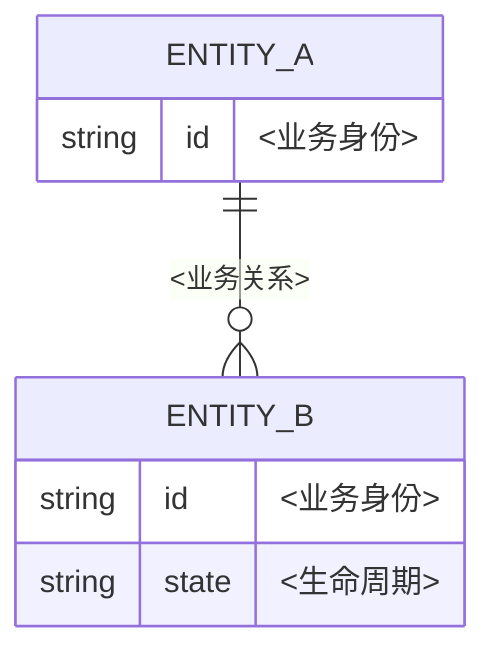

# 07 数据与数据库设计

> 结果：明确数据语义、所有权、约束、访问模式、一致性、迁移、保留和恢复方案，使数据变更可以在生产规模下安全执行。

| 字段 | 内容 |
|---|---|
| 状态 | 草案 / 评审中 / 已批准 / 已取代 |
| 负责人 | [填写] |
| 评审人 | [业务、后端、数据库、安全/隐私、运维] |
| 最后更新 | YYYY-MM-DD |
| 范围/版本 | [数据域、存储或迁移版本] |
| 权威来源 | [迁移脚本、schema、目录、代码] |

## 1. 数据范围、所有权与分类

| ID | 数据集/实体 | 业务语义 | 唯一写入模块 | 读取者 | 记录主数据 | 分类 | 地域/合规 | 负责人 |
|---|---|---|---|---|---|---|---|---|
| DATA-XX | [填写] | [领域定义] | MOD-XX | [模块/分析/外部] | 是/否 | 公开/内部/敏感/受限 | [填写] | [填写] |

- 每类业务数据只有一个权威写入所有者。副本、缓存、搜索索引和分析数据必须标注来源、新鲜度和重建方式。
- 数据库适配器所有物理表，但领域模块所有数据的业务语义和不变式。

## 2. 概念、逻辑与物理模型

### 2.1 概念模型

概念模型只表达业务对象和关系，不出现表、列、ORM 或中间件术语。

### 2.2 逻辑模型

| 实体 | 属性 | 含义/单位 | 必填 | 可空语义 | 默认 | 敏感级别 | 来源 | 不变式 |
|---|---|---|---|---|---|---|---|---|
| DATA-XX | [填写] | [填写] | 是/否 | [未知/不适用/未采集] | [显式/无] | [填写] | 输入/派生/外部 | BR-XX |

不把“不知道”、“未提供”、“不适用”和“空字符串”无区别地压成 `NULL`。

### 2.3 物理模型

| 表/集合 | 主键 | 业务键 | 外键/关系 | 检查约束 | 唯一约束 | 分区 | 预估规模 | 迁移版本 |
|---|---|---|---|---|---|---|---|---|
| [填写] | [类型/生成] | [填写] | [删除/更新语义] | [不变式子集] | [填写] | [无/键] | [行数/年增长] | [填写] |

## 3. 标识、精度与时间

| 主题 | 决定 | 不变式 | 转换位置 | 验证 |
|---|---|---|---|---|
| 主键 | [自增/UUID/ULID/组合] | 稳定、不复用 | [应用/数据库] | [并发/分布式] |
| 外部 ID | [格式/不可猜测要求] | 不泄露内部序列 | [适配器] | [填写] |
| 金额/小数 | [整数最小单位/decimal] | 无浮点累积误差 | [领域模块] | [边界值] |
| 时间 | [UTC 存储 + 地区规则] | 区分发生/生效/处理时间 | [适配器] | [DST/闰日/时区] |

## 4. 约束、规范化与派生数据

- 将不依赖外部系统且能由存储引擎稳定保护的关键约束下沉到数据库，同时在领域模块返回可理解的业务错误。
- 默认使用规范化保护一致性。只有经过查询模式、规模和基准测证明时才反规范化。
- 派生字段必须说明权威输入、重算时机、漂移检测和修复方式。

| 派生数据 | 权威输入 | 为何存储 | 重算时机 | 漂移检测 | 修复 |
|---|---|---|---|---|---|
| [填写] | DATA-XX | [性能/审计/历史语义] | [写入/异步/批处理] | [比对指标/作业] | [重建/对账] |

## 5. 访问模式与索引

索引从已知访问模式推导，不按列猜测。

| ID | 用例/查询 | 过滤 | 排序 | 返回量 | 频率/峰值 | 延迟目标 | 索引/分区 | 基准测证据 |
|---|---|---|---|---|---|---|---|---|
| QRY-XX | UC-XX | [等值/范围/全文] | [列 + 方向] | [行/页] | [填写] | QR-XX | [列顺序/覆盖] | [计划 + 数据规模] |

| 索引 | 支持查询 | 列顺序/条件 | 写入成本 | 大小预算 | 重复/未使用检查 |
|---|---|---|---|---|---|
| [填写] | QRY-XX | [填写] | [填写] | [填写] | [看板/定期评审] |

## 6. 事务、隔离与并发

| 用例 | 读/写集 | 隔离级别 | 需防止的异常 | 并发控制 | 死锁/重试 | 长事务预算 |
|---|---|---|---|---|---|---|
| UC-XX | [表/行/范围] | [填写] | [丢失更新/写偏差等] | [版本/锁/约束] | [可重试整个决策] | [最长时间/行数] |

隔离级别不是全库统一选项；根据具体不变式和并发异常选择。并发测试必须使用真实数据库和可控同步点。

## 7. 审计、历史与删除

| 数据 | 当前状态 | 历史需求 | 审计内容 | 不可变性 | 软删除理由 | 恢复/更正 |
|---|---|---|---|---|---|---|
| DATA-XX | [表/文档] | [无/快照/事件/有效期] | [主体、时间、动作、原因、结果] | [保护方式] | [无/依赖兼容] | [补偿记录/纠正流程] |

软删除会增加每个查询、唯一约束、索引和隐私删除的复杂度，只在有明确恢复或兼容需求时使用。审计记录不等于应用调试日志。

## 8. Schema 迁移与数据转换

| 迁移 ID | 目标 | 变更类型 | 估算规模/时间 | 锁/容量影响 | 兼容窗口 | 回退 | 验证 | 负责人 |
|---|---|---|---|---|---|---|---|---|
| MIG-XX | [填写] | schema/回填/约束/索引 | [行数/字节/速率] | [填写] | [旧/新应用兼容期] | [可逆/前向修复/恢复] | [计数/校验/对账] | [填写] |

高风险在线迁移优先使用扩展、回填、切换、收缩的步骤：

1. **扩展**：增加向后兼容的 schema，旧代码仍可运行。
2. **回填**：分批、可暂停、可重试地填充数据，控制负载和副本延迟。
3. **切换**：双读/双写只在确有必要时使用，且有漂移指标和单一切换条件。
4. **收缩**：确认旧版本无流量、数据已对账且备份可恢复后，再删除旧结构。

## 9. 保留、隐私与数据生命周期

| 数据 | 收集目的/法律依据 | 最小字段 | 保留期 | 归档 | 删除触发 | 备份/副本删除 | 出口/访问 |
|---|---|---|---|---|---|---|---|
| DATA-XX | [由合格角色确认] | [填写] | [填写] | [位置/加密] | [时间/用户请求/合同] | [时限/方式] | [身份/审计/格式] |

保留期不用“永久”作默认值。删除设计需覆盖主库、副本、缓存、搜索、分析、文件、队列、备份和第三方副本，并保留必要而最小的删除证据。

## 10. 备份、恢复、复制与灾备

| 存储 | RPO | RTO | 备份类型/频率 | 加密/隔离 | 恢复流程 | 最后演练 | 证据 |
|---|---|---|---|---|---|---|---|
| [填写] | [最大可丢失数据] | [最长恢复时间] | [全量/增量/PITR] | [密钥/账户/区域] | [runbook] | YYYY-MM-DD | [恢复报告] |

- “有备份”只在实际恢复到独立环境、完成应用级校验并达到 RPO/RTO 后才成立。
- 说明同步/异步复制、副本延迟、读后写一致性、故障转移数据丢失和回切流程。

## 11. 容量、性能与可观测性

| 信号 | 当前/预测 | 阈值 | 时间窗口 | 应对动作 | 负责人 |
|---|---|---|---|---|---|
| 存储大小/增长 | [填写] | [填写] | [填写] | [扩容/归档/分区] | [填写] |
| 连接/队列/锁 | [填写] | [填写] | [填写] | [限流/查询修复] | [填写] |
| 查询延迟/扫描行 | [填写] | QR-XX | [填写] | [计划/索引/语义修复] | [填写] |
| 副本延迟/备份年龄 | [填写] | RPO 导出 | [填写] | [停止运维操作/切换] | [填写] |

## 12. 测试与验证

| 风险 | 验证 | 数据规模/环境 | 通过条件 | 证据 |
|---|---|---|---|---|
| 约束与并发 | 真实引擎集成测试 | [最小 + 竞争] | 不变式在并发下成立 | [报告] |
| 查询与索引 | 查询计划 + 基准测 | [生产分布的匿名/合成数据] | 达到 QR-XX | [计划/报告] |
| 迁移 | 从生产前版本升级 | [规模副本] | 时间/锁/校验达标 | [演练] |
| 回退/前向修复 | 故障注入演练 | [升级中途] | 恢复且无额外丢失 | [演练] |
| 备份恢复 | 独立环境恢复 | [完整链路] | RPO/RTO + 应用校验 | [报告] |

## 13. 完成检查

- [ ] 每类数据的业务语义、唯一写入所有者、读取者和分类已明确。
- [ ] 概念、逻辑和物理模型一致，可空、时间、金额和标识语义无歧义。
- [ ] 关键不变式由领域模块和可靠的数据库约束双重保护。
- [ ] 每个索引都对应已知查询和基准测，写入与存储成本已评估。
- [ ] 事务隔离与并发控制由具体异常和不变式驱动。
- [ ] 迁移已在代表性数据规模上演练，有兼容窗口、回退/前向修复和对账。
- [ ] 保留和删除覆盖主库、副本、缓存、分析、备份和第三方。
- [ ] 备份已实际恢复并通过应用级校验，RPO/RTO 有证据。

