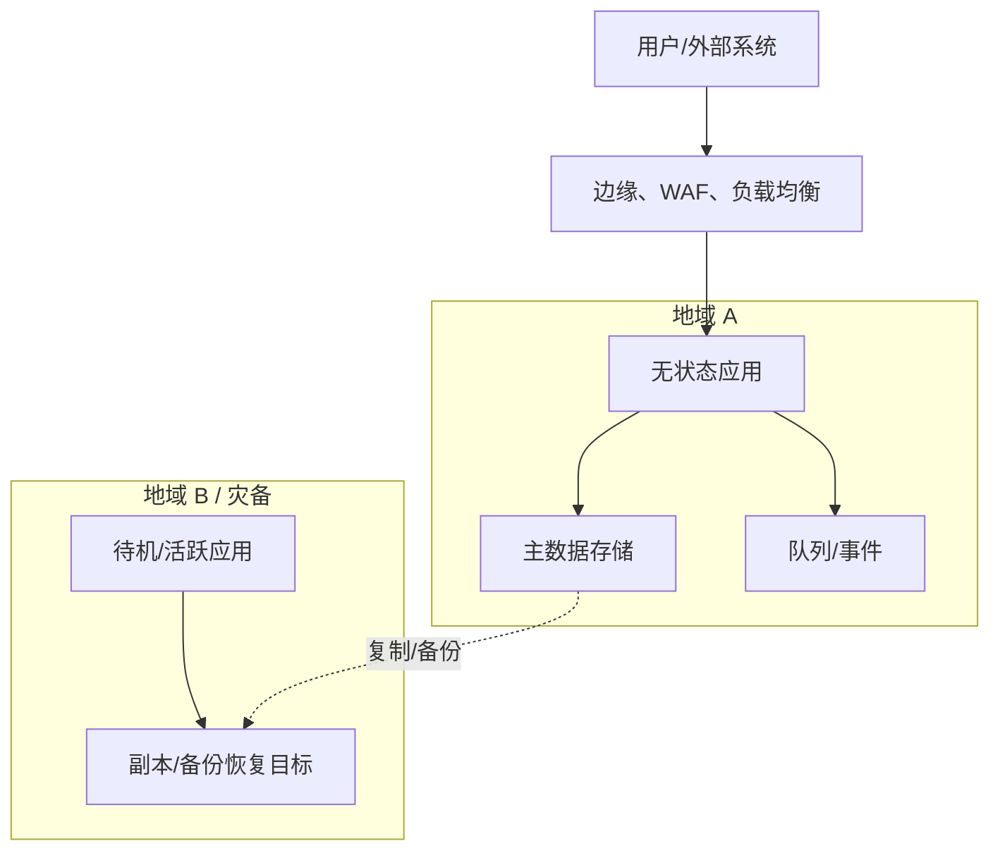

# 08 平台、安全与可靠性设计

> 结果：说明软件如何被构建、部署、保护、观测、扩展、降级和恢复，并将可靠性与安全承诺转换为可执行控制和验证。

| 字段 | 内容 |
|---|---|
| 状态 | 草案 / 评审中 / 已批准 / 已取代 |
| 负责人 | [填写] |
| 评审人 | [平台、安全、开发、数据、测试、运维] |
| 最后更新 | YYYY-MM-DD |
| 范围/版本 | [系统/环境/地域] |
| 权威来源 | [IaC、CI/CD、SLO、告警、runbook、安全要求] |

## 1. 环境、地域与部署拓扑

| 环境 | 目的 | 数据分类 | 外部访问 | 变更方式 | 与生产差异 | 负责人 |
|---|---|---|---|---|---|---|
| 本地/测试/预发/生产 | [填写] | [合成/脱敏/真实] | [网络/身份] | [CI/CD/IaC] | [必须显式] | [填写] |

图中标出信任区、公网/私网、加密终止、状态资源、单点、部署与扩展单元、地域间数据流和第三方依赖。

## 2. 构建、发布与运行

参考 [The Twelve-Factor App](https://12factor.net/) 中依赖显式、配置外置、构建/发布/运行分离和无状态进程等原则，但按当前平台和威胁模型调整。

| 阶段 | 输入 | 产物 | 不变式 | 签名/来源 | 保留 | 可重现验证 |
|---|---|---|---|---|---|---|
| 构建 | 锁定源码/依赖/工具链 | 不可变制品 | 一次构建、多环境提升 | [SBOM/签名/摘要] | [填写] | [填写] |
| 发布 | 制品 + 版本化配置 | 发布记录 | 可审计、可回退 | [批准/变更单] | [填写] | [填写] |
| 运行 | 发布记录 + 密钥 | 运行实例 | 不在实例内手工修改 | [工作负载身份] | [日志/追踪] | [漂移检测] |

## 3. 配置与密钥

| 配置/密钥 | 所有者 | 来源 | 读取身份 | 环境范围 | 验证 | 轮换 | 撤销/应急 |
|---|---|---|---|---|---|---|---|
| [填写] | [填写] | [配置库/密钥管理] | [最小权限] | [填写] | [schema/启动检查] | [双凭据窗口] | [填写] |

- 密钥不进入源码、制品、镜像层、普通配置、日志或测试快照。
- 轮换流程需要同时支持旧新凭据的受控窗口，并通过真实演练验证。

## 4. CI/CD 与变更策略

| 阶段 | 自动检查 | 手工批准条件 | 制品 | 失败行为 | 证据 |
|---|---|---|---|---|---|
| PR | [格式/单元/契约/安全/IaC] | [高风险 ADR/豁免] | [候选] | 阻止合并 | [检查链接] |
| 构建 | [依赖/SBOM/签名/快照] | [填写] | [不可变制品] | 不发布 | [摘要/来源] |
| 预发 | [迁移/端到端/性能/安全] | [风险批准] | [发布记录] | 停止提升 | [报告] |
| 生产 | [健康/金丝雀/SLO] | [不可逆变更] | [同一制品] | 自动停止/回退 | [发布时间线] |

| 变更类型 | 策略 | 分流单元 | 观察窗口 | 停止条件 | 回退/前向修复 |
|---|---|---|---|---|---|
| 应用 | 滚动/蓝绿/金丝雀 | [实例/租户/地域] | [填写] | [SLO/业务指标] | [填写] |
| 数据 | 扩展-回填-切换-收缩 | [分批键] | [对账周期] | [锁/延迟/错误] | [07 章节] |
| 配置/开关 | 版本化逐步开启 | [用户/租户/百分比] | [填写] | [填写] | [一键关闭 + 数据处理] |

## 5. 威胁模型

高风险设计必须记录数据流、信任区、资产、主体、入口、威胁、控制和残余风险。使用 [OWASP ASVS 5.0.0](https://owasp.org/www-project-application-security-verification-standard/) 的稳定要求 ID 作为 Web 应用控制与验证的追踪基线，但不用通用清单代替当前系统的威胁分析。

### 5.1 资产与信任区

| 资产 | 价值/损害 | 所在位置 | 信任区 | 可访问主体 | 数据分类 |
|---|---|---|---|---|---|
| [身份/资金/业务数据/密钥/可用性] | [填写] | [填写] | [填写] | [填写] | [填写] |

### 5.2 威胁与控制

| ID | 威胁/滥用场景 | 先决条件 | 影响 | 预防 | 检测 | 响应/恢复 | 验证 | 残余风险 |
|---|---|---|---|---|---|---|---|---|
| THREAT-XX | [攻击者目标和路径] | [填写] | [C/I/A/安全保障] | [控制 + ASVS ID] | [信号/告警] | [runbook] | TEST-SEC-XX | [严重度/接受人] |

## 6. 身份、访问与租户隔离

| 主体 | 认证方式 | 凭据寿命 | 授权模型 | 特权提升 | 租户隔离层 | 审计 | 终止访问时限 |
|---|---|---|---|---|---|---|---|
| 用户/管理员/工作负载/机器 | [填写] | [填写] | [RBAC/ABAC/关系] | [审批/时限/双人] | [应用/查询/存储/密钥] | [填写] | [填写] |

人员和工作负载都使用最小权限和短期凭据。管理员界面、调试通道和紧急访问必须纳入同一威胁、审计和撤销模型。

## 7. 供应链与漏洞管理

| 对象 | 锁定/来源 | 生成证据 | 扫描 | 允许标准 | 异常负责人/到期 | 运行暴露 |
|---|---|---|---|---|---|---|
| 依赖/基础镜像/构建工具/IaC/制品 | [摘要/受信仓库] | [SBOM/签名/来源] | [SCA/镜像/密钥/IaC] | [严重性/可利用性/时限] | [豁免理由 + 补偿控制] | [使用哪个版本] |

## 8. SLI、SLO 与误差预算

参考 [Google SRE: Implementing SLOs](https://sre.google/workbook/implementing-slos/) 从用户可见结果定义 SLI。SLO 不等于机器 CPU 阈值，也不默认等于外部 SLA。

| ID | 用户体验/能力 | SLI 事件 | 良好事件 | 有效事件 | 目标 | 窗口 | 数据源 | 误差预算策略 |
|---|---|---|---|---|---|---|---|---|
| SLO-XX | [填写] | [请求/作业/数据新鲜度] | [正确且阈值内] | [排除不应计入项] | [99.9% 等] | [滚动/日历] | [遥测/合成探针] | [耗尽时停发布/降低风险] |

告警优先围绕误差预算消耗和用户可见失败，并同时有快速燃烧和慢速燃烧窗口。每个页面级告警必须有明确用户影响、立即行动和 runbook。

## 9. 故障模型与弹性

| ID | 依赖/资源 | 故障 | 用户表现 | 检测 | 自动响应 | 降级 | 恢复/对账 | 演练 |
|---|---|---|---|---|---|---|---|---|
| FAIL-XX | [填写] | 超时/错误/慢/陈旧/容量耗尽 | [填写] | [指标/日志/追踪/探针] | [限流/熔断/转移] | [停止/只读/旧值/排队] | [填写] | GAME-XX |

覆盖计算、网络、数据库、队列、缓存、密钥服务、DNS、时钟、证书、配额、第三方和人工运维失误。关键流程要说明部分成功和故障恢复后如何对账。

## 10. 可观测性

参考 [OpenTelemetry Observability Primer](https://opentelemetry.io/docs/concepts/observability-primer/) 设计指标、日志和分布式追踪。可观测性不是“收集一切”，而是能从已知输出回答运行问题。

| 问题 | 信号 | 关键属性 | 关联 | 保留/采样 | 查询/看板 | 成本预算 |
|---|---|---|---|---|---|---|
| 用户是否成功 | 业务指标 + 合成探针 | 结果、版本、地域 | [trace/release] | [填写] | [填写] | [基数/数量] |
| 慢在哪一段 | 分布式追踪 | 模块、依赖、尝试、结果 | trace ID | [按结果/延迟采样] | [填写] | [填写] |
| 为何失败 | 结构化日志 + trace | 事件、原因码、请求 ID | trace ID | [填写] | [填写] | [不记敏感值] |

## 11. 容量、扩展与负载保护

| 资源/能力 | 当前 | 预测峰值 | 安全余量 | 扩展信号 | 扩展单元/上限 | 饱和时行为 | 容量测试 |
|---|---|---|---|---|---|---|---|
| 计算/连接/队列/存储/第三方配额 | [填写] | [填写] | [填写] | [并发/队列深度/延迟] | [填写] | [限流/拒绝/降级] | TEST-CAP-XX |

负载保护必须在排队、线程、连接或内存耗尽前生效，并向调用者返回明确的重试或停止语义。

## 12. 事故响应、灾备与业务连续性

| 场景 | 宣布条件 | 指挥/沟通 | 服务恢复 | 数据恢复 | 降级运行 | 回切 | 演练频率 |
|---|---|---|---|---|---|---|---|
| [地域/数据/安全/依赖事故] | [填写] | [角色/渠道/状态更新] | [RTO/runbook] | [RPO/恢复源] | [只读/排队/手工] | [数据对账/流量] | [填写] |

每次演练记录实际 RTO/RPO、操作阻塞、监控缺口、未完成行动和负责人。不在事故时首次测试备份凭据、域名切换或恢复脚本。

## 13. 成本与资源治理

| 成本驱动 | 单位成本 | 预算/阈值 | 归属标签 | 异常检测 | 优化选项 | 不可牺牲的 SLO/控制 |
|---|---|---|---|---|---|---|
| 计算/存储/网络/遥测/第三方 | [每请求/用户/事件] | [填写] | [产品/环境/所有者] | [预测/同比] | [填写] | [填写] |

## 14. 完成检查

- [ ] 环境差异、信任区、状态资源、单点、部署和扩展单元已可见。
- [ ] 同一不可变制品在环境间提升，有签名、来源、SBOM 和发布记录。
- [ ] 密钥不进入源码/制品/日志，访问、轮换、撤销和应急流程已演练。
- [ ] 威胁模型覆盖资产、信任区、入口、预防、检测、响应和残余风险。
- [ ] 供应链制品已锁定、扫描、签名且可追溯，豁免有到期日期和补偿控制。
- [ ] SLI 从用户可见结果定义，SLO、窗口、数据源、误差预算和响应策略完整。
- [ ] 关键依赖和资源的超时、饱和、降级、恢复和对账已通过故障演练。
- [ ] 灾备从备份实际恢复到可服务状态，实测 RPO/RTO 达标。

